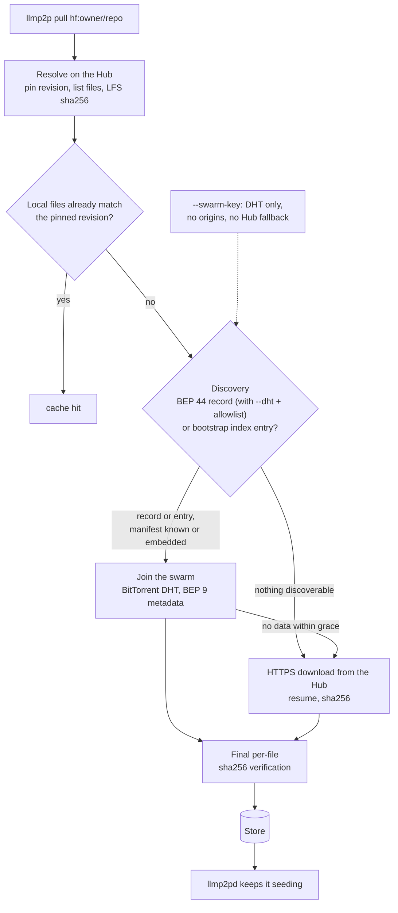

# llmp2p

[](https://github.com/log0u7/llmp2p/actions/workflows/ci.yml)
[](https://github.com/log0u7/llmp2p/releases)
[](https://go.dev/doc/devel/release)
[](LICENSE)

P2P distribution of LLM model artifacts: pull Hugging Face model repositories
through a BitTorrent swarm when peers exist, fall back to HTTPS from the Hub
when they do not, and keep your models seeding for everyone else.

## Why

GGUF models are 1-100+ GB files served over plain HTTP: every download hits the
Hub again. llmp2p treats models as what they are, large immutable blobs that a
swarm serves better than a single origin. The more popular a model, the faster
it distributes.

**Good fit**: sharing GGUF repos, homelabs with several machines, sparing the
Hub. **Bad fit**: first pull of a model nobody seeds.

Highlights:

- **End-to-end verification**: every byte is checked against torrent piece
  hashes, the manifest's per-file sha256, and Hub-published LFS oids.
- **Signed manifests**: publishers sign with ed25519 (`llmp2p keygen`);
  fetchers enforce an optional signer allowlist.
- **Decentralized discovery** (`pull --dht`): BEP 44 mutable records signed
  by the publisher's key replace the bootstrap index; small manifests travel
  inside the record itself.
- **Private swarm mode** (`pull --swarm-key`): DHT-only discovery under a
  shared key, no bootstrap origins, no Hub fallback.

## Quickstart

Install the CLI and the daemon, from the
[release page](https://github.com/log0u7/llmp2p/releases) (linux/macos/windows
binaries; on macOS, clear the Gatekeeper flag on first run:
`xattr -d com.apple.quarantine llmp2p`), or with Go 1.25+ (the `go.mod` pins
the toolchain, `GOTOOLCHAIN=auto` handles it):

```sh
go install github.com/log0u7/llmp2p/cmd/llmp2p@latest
go install github.com/log0u7/llmp2p/cmd/llmp2pd@latest
```

Then pull, import, share:

```sh
llmp2p pull hf:Qwen/Qwen2.5-0.5B-Instruct-GGUF
llmp2p import hf:Qwen/Qwen2.5-0.5B-Instruct-GGUF --name qwen2.5-0.5b
ollama run qwen2.5-0.5b

llmp2pd
curl -s localhost:8347/api/v1/status | jq
```

Expected result after `pull`: a `manifest <sha256>` / `infohash <40hex>` line
pair, and `llmp2p list` showing the model with its pinned revision.

### Alternative: build from source

Instead of `go install`, build from a clone.
[mise](https://mise.jdx.dev) pins the whole dev environment (`go`,
`golangci-lint`, `gitleaks`) in [mise.toml](mise.toml):

```sh
git clone https://github.com/log0u7/llmp2p.git && cd llmp2p
mise install      # first task run may ask for `mise trust`
make build        # bin/llmp2p + bin/llmp2pd
```

## How a pull works



With `--dht`, the swarm entry (and for small models the manifest itself) is a
record signed by the publisher's key: no bootstrap index needed. Every byte is
verified twice: against torrent piece hashes during transfer, then against the
manifest's per-file sha256 (Hub LFS oid).

## Commands

| Command | Purpose |
|---|---|
| `llmp2p pull <ref>` | pull a repo: swarm, then HTTP fallback (`--dht`, `--swarm-key` for decentralized/private discovery) |
| `llmp2p seed <ref\|.torrent>` | seed until interrupted |
| `llmp2p import <ref\|.gguf>` | register the GGUF in Ollama |
| `llmp2p list` | show stored models |
| `llmp2p verify <ref>` | re-verify a stored model's integrity |
| `llmp2p remove <ref>` | remove a model from the store |
| `llmp2p keygen` | generate the ed25519 publisher key used to sign manifests |
| `llmp2pd` | background seeder + status API on `127.0.0.1:8347` |

Full grammar and flags: [docs/reference/cli.md](docs/reference/cli.md) ·
daemon API: [docs/reference/daemon-api.md](docs/reference/daemon-api.md).

## Make a model discoverable

Every pull publishes to your local index. Two ways to share beyond your
machine:

- **Open a PR** adding the entry (and its manifest) to this repository's
  [index.json](index.json): the shared trust root, discoverable by strangers
  with no key exchange. [docs/how-to/contribute-index-entry.md](docs/how-to/contribute-index-entry.md)
- **Publish into the DHT**: run `llmp2p keygen`, then pull with `--dht` — a
  signed record makes the swarm discoverable to anyone trusting your public
  key (`--allowed-signers`, or `--swarm-key` for a private swarm). See
  [docs/how-to/private-swarm.md](docs/how-to/private-swarm.md).

## Documentation

Organized as [Diátaxis](https://diataxis.fr/): start at
[docs/README.md](docs/README.md).

| I want to... | Read |
|---|---|
| learn hands-on, start to finish | [tutorials/get-started.md](docs/tutorials/get-started.md) |
| solve a specific task | [docs/how-to/](docs/how-to/) |
| look up a command, flag, or schema | [docs/reference/](docs/reference/) |
| understand how and why it works | [docs/explanation/](docs/explanation/) (architecture, trust model, protocol) |
| know why the code looks this way | [docs/adr/](docs/adr/) (8 MADR decision records) |
| review security audit findings | [docs/audits/](docs/audits/) |

## Status

v0.3.0, experimental: whole-repo pulls work end to end (swarm, DHT discovery,
private swarms), the protocol may still change before 1.0. See
[ROADMAP.md](ROADMAP.md).

## Contributing

[CONTRIBUTING.md](CONTRIBUTING.md): Conventional Commits, atomic changes,
gitleaks pre-commit hook, tests required. Security issues: see
[docs/explanation/trust-model.md](docs/explanation/trust-model.md) for what is
protected before opening an issue.

## License

[MIT](LICENSE)
