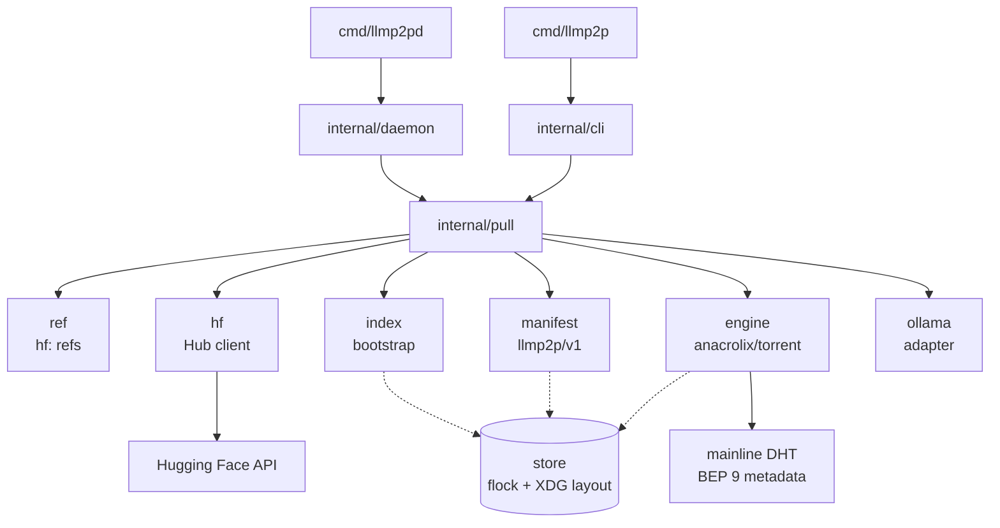

# Architecture

How llmp2p is put together and why. For the wire-level view see
[protocol.md](protocol.md); for security see [trust-model.md](trust-model.md).

## The big picture

The store is shared by exactly one engine at a time (flock).

## Package responsibilities

| Package | Responsibility | Does NOT |
|---|---|---|
| `ref` | parse/validate `hf:` references | touch the network |
| `hf` | Hub client: pin revisions, list files, download with resume + sha256 | build manifests |
| `manifest` | `llmp2p/v1` schema, hashing, metainfo build/verify | know about HTTP or peers |
| `index` | bootstrap index fetch/merge/publish | download data |
| `engine` | torrent client wrapper: pull by infohash, seed, stats | know about models |
| `pull` | orchestrate: resolve, cache, P2P, fallback, publish | implement transfers itself |
| `store` | on-disk layout, content-addressed paths, flock | interpret content |
| `ollama` | GGUF discovery, Modelfile, `ollama create` | mutate Ollama blobs |
| `daemon` | background seeding + loopback status API | pull (v0; v0.1 moves pull here) |

The layering is deliberate: lower packages are network- or storage-agnostic and
the orchestration lives in exactly one place (`pull`).

## Key design points

- **Determinism over state**: metainfos are built from file lists with fixed
  piece length and a name derived from the repo. Two independent first pullers
  compute the same infohash and therefore the same swarm without coordination.
- **Content-addressed everything**: manifests are stored by their own sha256,
  torrents by infohash, models by validated `owner/repo` paths.
- **One writer**: the store flock serializes engines. The daemon waits for CLI
  commands instead of fighting them (v0.1 will move pulling into the daemon).
- **Fallback is not an afterthought**: the Hub HTTPS path is the seed path and
  the correctness oracle (LFS sha256) at once.

## Failure behavior

- P2P attempt with no data within `--grace` (default 90s) cancels and falls
  back to HTTP.
- A cache hit re-verifies every file's sha256; corruption triggers a fresh
  pull, never silent reuse.
- `pull` never leaves a torn state published: manifests and torrent are written
  only after full verification.
