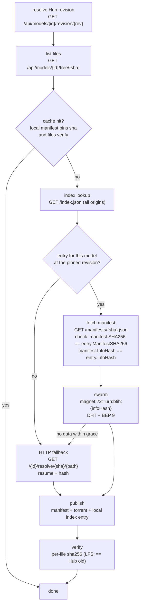

# The llmp2p protocol

The moving parts on the wire, and how a model goes from "only on the Hub" to
"swarming".

## Addressing scheme

```
model id   owner/repo                       (identity)
revision   pinned commit sha                (immutability anchor)
manifest   sha256(canonical JSON)           (content address)
infohash   sha1(info dict)                  (swarm address)
```

A manifest maps the first three to the last one. The infohash is *derived*, not
invented: piece length is fixed (4 MiB) and the torrent root name is the repo
basename, so any party that has the files computes the same swarm address.

## Bootstrap origins

An origin is a base URL serving:

```
<base>/index.json                    {"entries": {"owner/repo": {...}}}
<base>/manifests/<sha256>.json       the manifest itself
```

Index entry:

```json
{"model": "owner/repo", "infoHash": "40hex", "manifestSha256": "64hex",
 "revision": "commitsha", "size": 123, "addedAt": "...", "addedBy": "..."}
```

Clients fetch origins in order and merge with first-origin-wins; conflicting
entries are surfaced as warnings, invalid entries are dropped. The default
origin is this repository's raw GitHub content; origins are user-extensible.

## Pull state machine



## BitTorrent specifics

- **v1 metainfo** (BEP 3): SHA-1 piece hashes, widest compatibility. The
  security root remains SHA-256 at the manifest and file level (ADR-0003).
- **BEP 9** (ut_metadata): leechers learn the info dict from peers given only
  the infohash; the manifest is not needed on the wire.
- **Mainline DHT** (BEP 5) for peer discovery, standard bootstrap routers.
- Seeding: every completed model is a full seeder; `llmp2pd` keeps swarms alive.

## Ollama import

Out of protocol scope on purpose: `import` shells out to `ollama create` with a
`FROM <path>` Modelfile. Ollama's blob layout is version-dependent; the CLI is
the stable interface (ADR-0006).
