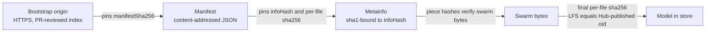

# Trust model

What protects you from bad bytes when strangers serve your model, and what does
not (yet).

## The chain

## What each link gives you

- **Bootstrap origin**: the only privileged component. It is HTTPS + this
  repository (PR-reviewed `index.json`). A malicious origin could point you at
  a poisoned manifest, but:
- **Manifest sha256** recorded in the index must match the fetched manifest, so
  tampering means rewriting the index (i.e. compromising the origin).
- **infoHash** binds the swarm: peers exchange the metainfo by infohash (BEP 9)
  and piece hashes inside it are self-verifying. A stranger cannot feed you
  foreign data under an honest manifest.
- **Final sha256**: every file is re-hashed after download and compared to the
  manifest; LFS files must equal the Hub's published oid, which is the
  authoritative upstream hash. This is the strongest link: even a corrupted
  bootstrap chain cannot give you a model that differs from what the Hub serves.

## Threats explicitly covered

- malicious peer bytes (poisoned chunks) -> piece hash mismatch, transfer stalls
- malicious manifest -> final sha256 mismatch, nothing is published
- manifest/index mismatch -> rejected before any transfer
- path traversal -> reference and index validation reject `..`, absolute paths,
  and control characters; store paths are validated `owner/repo` pairs

## What v0 does NOT protect against

- **A fully compromised bootstrap origin** that also serves consistent poisoned
  manifests: the final sha256 check fails against Hub oids only for LFS files,
  and only while the Hub is up and honest. Small non-LFS files are only pinned
  by the manifest.
- **No signature scheme yet**: manifests are not signed (roadmap: ed25519
  signatures + signer allowlists).
- **The Hub itself**: sha256 oids are taken from Hub metadata over HTTPS.
- **Privacy**: pulls are visible to the swarm you join and to bootstrap origins.

## Practical advice

For high-value targets, prefer repos whose GGUFs are LFS-backed (oid-checked)
and keep `pull`'s default flow (never disable verification: there are no flags
to do so, by design).
